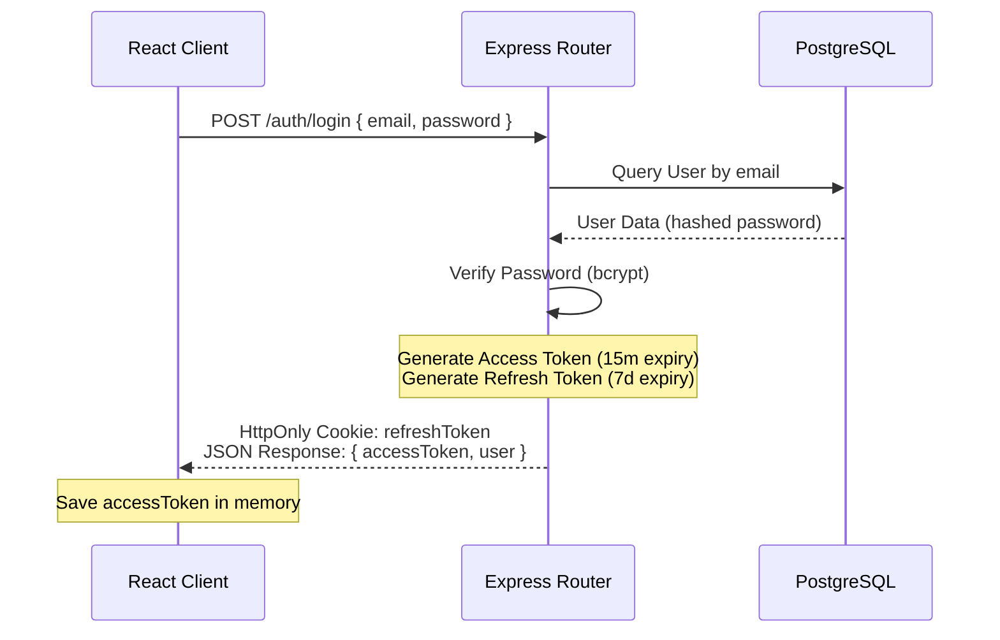
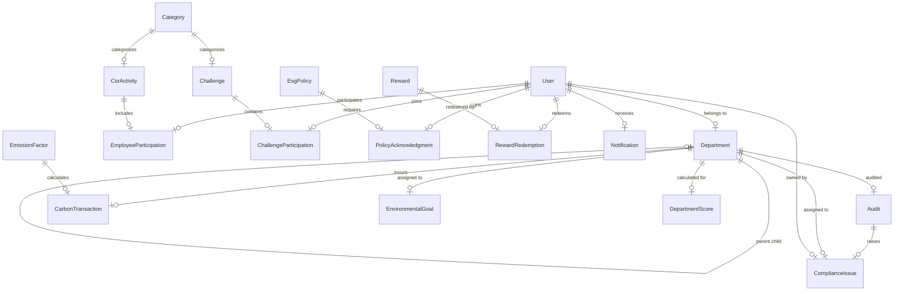

# EcoSphere – ESG Management Platform
## Complete Software Architecture Specification

This document defines the architecture, system design, data models, APIs, and plans for the **EcoSphere – ESG Management Platform**.

---

## 1. Complete Folder Structure

```text
EcoSphere-ESG-Platform/
├── README.md
├── LICENSE
├── .gitignore
├── docker/
│   ├── docker-compose.yml
│   └── README.md
├── docs/
│   ├── architecture.md
│   ├── api-documentation.md
│   ├── database-design.md
│   ├── ui-guidelines.md
│   └── deployment.md
├── scripts/
│   └── seed-data.js
├── shared/
│   ├── types/
│   │   └── index.ts
│   ├── constants/
│   │   └── esg.ts
│   ├── interfaces/
│   │   └── index.ts
│   └── utils/
│       └── formatters.ts
├── .github/
│   └── workflows/
│       └── build-test.yml
├── frontend/
│   ├── public/
│   │   └── favicon.ico
│   ├── src/
│   │   ├── main.tsx
│   │   ├── App.tsx
│   │   ├── assets/
│   │   ├── components/
│   │   ├── pages/
│   │   ├── hooks/
│   │   ├── services/
│   │   ├── api/
│   │   ├── context/
│   │   ├── store/
│   │   ├── routes/
│   │   ├── layouts/
│   │   ├── utils/
│   │   ├── constants/
│   │   ├── types/
│   │   ├── styles/
│   │   └── lib/
│   ├── package.json
│   ├── vite.config.ts
│   └── tsconfig.json
└── backend/
    ├── src/
    │   ├── app.ts
    │   ├── config/
    │   ├── controllers/
    │   ├── routes/
    │   ├── middleware/
    │   ├── services/
    │   ├── repositories/
    │   ├── validators/
    │   ├── models/
    │   ├── interfaces/
    │   ├── dto/
    │   ├── helpers/
    │   ├── utils/
    │   ├── constants/
    │   ├── modules/
    │   └── uploads/
    ├── prisma/
    │   ├── schema.prisma
    │   ├── seed.ts
    │   └── migrations/
    ├── package.json
    ├── tsconfig.json
    └── .env.example
```

---

## 2. Frontend Folder Structure

```text
frontend/src/
├── main.tsx                         # Entry point
├── App.tsx                          # App router shell & Toast provider
├── assets/                          # Images, SVGs, static files
├── styles/
│   └── index.css                    # Tailwind CSS directives & theme tokens
├── lib/
│   └── utils.ts                     # cn utility for Tailwind classes merging
├── components/
│   ├── common/                      # Global reusable components
│   │   ├── Button.tsx
│   │   ├── Card.tsx
│   │   ├── Dialog.tsx
│   │   ├── Input.tsx
│   │   ├── Select.tsx
│   │   ├── Table.tsx
│   │   └── Badge.tsx
│   ├── dashboard/                   # Dashboard widgets
│   │   ├── ScoreCard.tsx
│   │   └── RecentActivities.tsx
│   ├── charts/                      # Recharts chart components
│   │   ├── EmissionTrendChart.tsx
│   │   └── DepartmentRankingChart.tsx
│   ├── environmental/               # Environmental feature-specific components
│   │   ├── EmissionLogModal.tsx
│   │   └── GoalTrackerCard.tsx
│   ├── social/                      # Social feature-specific components
│   │   ├── ActivityCard.tsx
│   │   └── ParticipationRow.tsx
│   ├── governance/                  # Governance feature-specific components
│   │   ├── PolicyAckStatus.tsx
│   │   └── AuditListTable.tsx
│   ├── gamification/                # Gamification widgets
│   │   ├── LeaderboardTable.tsx
│   │   └── BadgeItem.tsx
│   ├── reports/                     # Report preview & builder
│   │   └── CustomReportForm.tsx
│   └── settings/                    # Settings fields & admin config
│       └── DepartmentEditModal.tsx
├── pages/                           # Screen level components
│   ├── auth/
│   │   ├── LoginPage.tsx
│   │   └── RegisterPage.tsx
│   ├── dashboard/
│   │   └── DashboardPage.tsx
│   ├── environmental/
│   │   └── EnvironmentalPage.tsx
│   ├── social/
│   │   └── SocialPage.tsx
│   ├── governance/
│   │   └── GovernancePage.tsx
│   ├── gamification/
│   │   └── GamificationPage.tsx
│   ├── reports/
│   │   └── ReportsPage.tsx
│   └── settings/
│       └── SettingsPage.tsx
├── layouts/                         # Layout wrappers
│   ├── MainLayout.tsx               # Sidebar, header shell layout
│   └── AuthLayout.tsx               # Centered layout for auth forms
├── routes/
│   ├── AppRoutes.tsx                # Client route configuration
│   └── ProtectedRoute.tsx           # Route wrapper validating authentication
├── hooks/                           # Custom React hooks
│   ├── useAuth.ts                   # Auth convenience hook
│   └── useDebounce.ts               # Input search debouncer
├── services/                        # Raw API consumption handlers
│   ├── auth.service.ts
│   ├── esg.service.ts
│   └── report.service.ts
├── api/
│   └── apiClient.ts                 # Axios configuration (with JWT interceptors)
├── context/
│   └── AuthContext.tsx              # Authenticated user state provider
├── store/
│   └── useUIStore.ts                # Lightweight state (Sidebar toggle, theme)
├── constants/
│   └── navigation.ts                # Navigation mappings & configuration
├── types/
│   └── index.ts                     # Frontend specific typescript definitions
└── utils/
    └── date.ts                      # Date formatting utilities
```

---

## 3. Backend Folder Structure

```text
backend/src/
├── app.ts                           # Express app initialization
├── server.ts                        # App server bootstrap & port listener
├── config/
│   └── environment.ts               # Env configs (parsed via Zod)
├── middleware/
│   ├── auth.middleware.ts           # JWT and RBAC validations
│   ├── error.middleware.ts          # Global exception handler
│   └── validation.middleware.ts     # Zod request parser
├── routes/
│   └── index.ts                     # API root router combining all sub-routers
├── modules/                         # Domain modular structures
│   ├── auth/
│   │   ├── auth.controller.ts
│   │   ├── auth.service.ts
│   │   ├── auth.repository.ts
│   │   ├── auth.routes.ts
│   │   └── auth.validator.ts
│   ├── dashboard/
│   │   ├── dashboard.controller.ts
│   │   ├── dashboard.service.ts
│   │   └── dashboard.routes.ts
│   ├── environmental/
│   │   ├── environmental.controller.ts
│   │   ├── environmental.service.ts
│   │   ├── environmental.repository.ts
│   │   ├── environmental.routes.ts
│   │   └── environmental.validator.ts
│   ├── social/
│   │   ├── social.controller.ts
│   │   ├── social.service.ts
│   │   ├── social.repository.ts
│   │   ├── social.routes.ts
│   │   └── social.validator.ts
│   ├── governance/
│   │   ├── governance.controller.ts
│   │   ├── governance.service.ts
│   │   ├── governance.repository.ts
│   │   ├── governance.routes.ts
│   │   └── governance.validator.ts
│   ├── gamification/
│   │   ├── gamification.controller.ts
│   │   ├── gamification.service.ts
│   │   ├── gamification.repository.ts
│   │   ├── gamification.routes.ts
│   │   └── gamification.validator.ts
│   ├── reports/
│   │   ├── reports.controller.ts
│   │   ├── reports.service.ts
│   │   └── reports.routes.ts
│   └── settings/
│       ├── settings.controller.ts
│       ├── settings.service.ts
│       ├── settings.repository.ts
│       └── settings.routes.ts
├── uploads/                         # Folder target for Multer file uploads
├── interfaces/                      # Shared internal interfaces
├── dto/                             # Data Transfer Objects
├── helpers/                         # Cryptography, JWT generation
├── utils/                           # General helpers
└── constants/                       # Server-wide config mappings
```

---

## 4. Database Architecture

The database architecture is built on **PostgreSQL**, structured to enforce data integrity while facilitating low-latency dashboard aggregation.

### Key Considerations
1. **Primary Keys:** Standard UUIDs (`uuid_generate_v4()`) for robust and unguessable object references.
2. **Foreign Keys:** Enforce Referential Integrity. Disallow cascades on deletion for master config data (e.g. departments, categories) to prevent accidental data loss. Use soft-delete states (`status: INACTIVE` or `status: ARCHIVED`) instead of hard deletion.
3. **Database Indexing:**
   - Index on `User(email)` (Unique lookup).
   - Index on `CarbonTransaction(departmentId, transactionDate)` for fast periodic calculations.
   - Index on `DepartmentScore(departmentId, year, month)` (Unique combination index to fetch scores quickly).
   - Index on `EmployeeParticipation(userId, approvalStatus)` for leaderboard and points calculation.
4. **Scoring Aggregation:** Department scores are compiled periodically (or triggered on transaction logs) and saved in a cached table `DepartmentScore` to avoid calculating heavy sums on every dashboard render.

---

## 5. Prisma Schema Planning

The data model definition is specified in the schema below:

```prisma
datasource db {
  provider = "postgresql"
  url      = env("DATABASE_URL")
}

generator client {
  provider = "prisma-client-js"
}

enum Role {
  ADMIN
  MANAGER
  CONTRIBUTOR
}

enum TransactionSourceType {
  PURCHASE
  MANUFACTURING
  EXPENSE
  FLEET
}

enum Difficulty {
  EASY
  MEDIUM
  HARD
}

enum ChallengeStatus {
  DRAFT
  ACTIVE
  UNDER_REVIEW
  COMPLETED
  ARCHIVED
}

enum ApprovalStatus {
  PENDING
  APPROVED
  REJECTED
}

enum ComplianceSeverity {
  LOW
  MEDIUM
  HIGH
}

enum ComplianceStatus {
  OPEN
  RESOLVED
}

enum AuditOutcome {
  COMPLIANT
  ACTION_REQUIRED
}

enum CategoryType {
  CSR_ACTIVITY
  CHALLENGE
}

model User {
  id              String                   @id @default(uuid())
  email           String                   @unique
  passwordHash    String
  firstName       String
  lastName        String
  role            Role                     @default(CONTRIBUTOR)
  departmentId    String?
  department      Department?              @relation(fields: [departmentId], references: [id])
  xpBalance       Int                      @default(0)
  pointsBalance   Int                      @default(0)
  participations  EmployeeParticipation[]
  challenges      ChallengeParticipation[]
  acknowledgments PolicyAcknowledgment[]
  issuesOwned     ComplianceIssue[]        @relation("IssueOwner")
  redemptions     RewardRedemption[]
  notifications   Notification[]
  createdAt       DateTime                 @default(now())
  updatedAt       DateTime                 @updatedAt

  @@index([email])
}

model Department {
  id                 String            @id @default(uuid())
  name               String
  code               String            @unique
  head               String?           // Head name or user email
  parentDepartmentId String?
  parentDepartment   Department?       @relation("DeptHierarchy", fields: [parentDepartmentId], references: [id])
  subDepartments     Department[]      @relation("DeptHierarchy")
  employeeCount      Int               @default(0)
  status             String            @default("ACTIVE") // ACTIVE, INACTIVE
  users              User[]
  carbonTransactions CarbonTransaction[]
  goals              EnvironmentalGoal[]
  audits             Audit[]
  issues             ComplianceIssue[]
  scores             DepartmentScore[]
  createdAt          DateTime          @default(now())
  updatedAt          DateTime          @updatedAt
}

model Category {
  id            String         @id @default(uuid())
  name          String
  type          CategoryType
  status        String         @default("ACTIVE") // ACTIVE, INACTIVE
  activities    CsrActivity[]
  challenges    Challenge[]
  createdAt     DateTime       @default(now())
  updatedAt     DateTime       @updatedAt
}

model EmissionFactor {
  id                 String              @id @default(uuid())
  name               String
  factor             Float               // kg CO2e per unit
  unit               String              // e.g. kWh, Liters, km
  source             String              // e.g. DEFRA, EPA
  carbonTransactions CarbonTransaction[]
  createdAt          DateTime            @default(now())
  updatedAt          DateTime            @updatedAt
}

model ProductEsgProfile {
  id                        String   @id @default(uuid())
  productId                 String   @unique
  productName               String
  carbonFootprint           Float    // kg CO2e per product unit
  recycledContentPercentage Float    @default(0.0)
  waterFootprint            Float    @default(0.0) // Liters per product unit
  status                    String   @default("ACTIVE") // ACTIVE, INACTIVE
  createdAt                 DateTime @default(now())
  updatedAt                 DateTime @updatedAt
}

model EnvironmentalGoal {
  id           String          @id @default(uuid())
  title        String
  departmentId String
  department   Department      @relation(fields: [departmentId], references: [id])
  targetValue  Float
  currentValue Float           @default(0.0)
  unit         String
  deadline     DateTime
  status       ChallengeStatus @default(ACTIVE)
  createdAt    DateTime        @default(now())
  updatedAt    DateTime        @updatedAt
}

model EsgPolicy {
  id              String                 @id @default(uuid())
  title           String
  description     String
  contentUrl      String
  version         String                 @default("1.0.0")
  effectiveDate   DateTime
  status          String                 @default("ACTIVE") // ACTIVE, ARCHIVED
  acknowledgments PolicyAcknowledgment[]
  createdAt       DateTime               @default(now())
  updatedAt       DateTime               @updatedAt
}

model Badge {
  id          String   @id @default(uuid())
  name        String
  description String
  unlockRule  String   // JSON condition string e.g. '{"minXp": 500}' or '{"minCompletedChallenges": 5}'
  icon        String   // Icon asset name or URL
  createdAt   DateTime @default(now())
  updatedAt   DateTime @updatedAt
}

model Reward {
  id             String             @id @default(uuid())
  name           String
  description    String
  pointsRequired Int
  stock          Int                @default(0)
  status         String             @default("ACTIVE") // ACTIVE, INACTIVE
  redemptions    RewardRedemption[]
  createdAt      DateTime           @default(now())
  updatedAt      DateTime           @updatedAt
}

model CarbonTransaction {
  id                  String                @id @default(uuid())
  sourceType          TransactionSourceType
  sourceId            String                // External transaction ref
  quantity            Float
  unit                String
  emissionFactorId    String
  emissionFactor      EmissionFactor        @relation(fields: [emissionFactorId], references: [id])
  calculatedEmissions Float                 // quantity * emissionFactor
  departmentId        String
  department          Department            @relation(fields: [departmentId], references: [id])
  transactionDate     DateTime
  createdAt           DateTime              @default(now())
}

model CsrActivity {
  id             String                  @id @default(uuid())
  title          String
  description    String
  categoryId     String
  category       Category                @relation(fields: [categoryId], references: [id])
  pointsXp       Int                     @default(0)
  deadline       DateTime
  status         ChallengeStatus         @default(ACTIVE)
  participations EmployeeParticipation[]
  createdAt      DateTime                @default(now())
  updatedAt      DateTime                @updatedAt
}

model EmployeeParticipation {
  id             String         @id @default(uuid())
  userId         String
  user           User           @relation(fields: [userId], references: [id])
  csrActivityId  String
  csrActivity    CsrActivity    @relation(fields: [csrActivityId], references: [id])
  proofUrl       String?
  approvalStatus ApprovalStatus @default(PENDING)
  pointsEarned   Int            @default(0)
  completionDate DateTime?
  createdAt      DateTime       @default(now())
  updatedAt      DateTime       @updatedAt
}

model Challenge {
  id               String                   @id @default(uuid())
  title            String
  categoryId       String
  category         Category                 @relation(fields: [categoryId], references: [id])
  description      String
  xp               Int                      @default(0)
  difficulty       Difficulty               @default(EASY)
  evidenceRequired Boolean                  @default(false)
  deadline         DateTime
  status           ChallengeStatus          @default(DRAFT)
  participations   ChallengeParticipation[]
  createdAt        DateTime                 @default(now())
  updatedAt        DateTime                 @updatedAt
}

model ChallengeParticipation {
  id             String         @id @default(uuid())
  challengeId    String
  challenge      Challenge      @relation(fields: [challengeId], references: [id])
  userId         String
  user           User           @relation(fields: [userId], references: [id])
  progress       Float          @default(0.0) // 0.0 to 100.0
  proofUrl       String?
  approvalStatus ApprovalStatus @default(PENDING)
  xpAwarded      Int            @default(0)
  completedAt    DateTime?
  createdAt      DateTime       @default(now())
  updatedAt      DateTime       @updatedAt
}

model PolicyAcknowledgment {
  id             String    @id @default(uuid())
  policyId       String
  policy         EsgPolicy @relation(fields: [policyId], references: [id])
  userId         String
  user           User      @relation(fields: [userId], references: [id])
  acknowledgedAt DateTime  @default(now())
}

model Audit {
  id           String          @id @default(uuid())
  departmentId String
  department   Department      @relation(fields: [departmentId], references: [id])
  auditorName  String
  auditDate    DateTime
  score        Float
  outcome      AuditOutcome
  findings     String
  issues       ComplianceIssue[]
  createdAt    DateTime        @default(now())
  updatedAt    DateTime        @updatedAt
}

model ComplianceIssue {
  id           String             @id @default(uuid())
  auditId      String?
  audit        Audit?             @relation(fields: [auditId], references: [id])
  title        String
  description  String
  severity     ComplianceSeverity @default(MEDIUM)
  departmentId String
  department   Department         @relation(fields: [departmentId], references: [id])
  ownerId      String
  owner        User               @relation("IssueOwner", fields: [ownerId], references: [id])
  dueDate      DateTime
  status       ComplianceStatus   @default(OPEN)
  createdAt    DateTime           @default(now())
  updatedAt    DateTime           @updatedAt
}

model DepartmentScore {
  id                 String     @id @default(uuid())
  departmentId       String
  department         Department @relation(fields: [departmentId], references: [id])
  year               Int
  month              Int
  environmentalScore Float      @default(0.0)
  socialScore        Float      @default(0.0)
  governanceScore    Float      @default(0.0)
  totalScore         Float      @default(0.0)
  createdAt          DateTime   @default(now())
  updatedAt          DateTime   @updatedAt

  @@unique([departmentId, year, month])
}

model RewardRedemption {
  id             String         @id @default(uuid())
  userId         String
  user           User           @relation(fields: [userId], references: [id])
  rewardId       String
  reward         Reward         @relation(fields: [rewardId], references: [id])
  pointsDeducted Int
  redemptionDate DateTime       @default(now())
  status         ApprovalStatus @default(PENDING)
}

model Notification {
  id        String   @id @default(uuid())
  userId    String
  user      User     @relation(fields: [userId], references: [id])
  title     String
  message   String
  type      String   // COMPLIANCE_ISSUE, APPROVAL, POLICY_REMINDER, BADGE_UNLOCK
  isRead    Boolean  @default(false)
  createdAt DateTime @default(now())
}

model SystemConfig {
  id                     String  @id @default("singleton")
  enableAutoEmission     Boolean @default(true)
  requireEvidenceCsr     Boolean @default(true)
  autoAwardBadges        Boolean @default(true)
  pushAlertCompliance    Boolean @default(true)
  environmentalWeight    Float   @default(0.40)
  socialWeight           Float   @default(0.30)
  governanceWeight       Float   @default(0.30)
  enableNotificationEmail Boolean @default(false)
}
```

---

## 6. API Endpoint Planning

All API routes are prefixed by `/api/v1` and return JSON structured payloads.

### 6.1 Authentication (`/auth`)
- `POST /auth/register` - Create user (Contributors/Managers initialized; Admin created through seeding).
- `POST /auth/login` - Validate credentials, return access token in body and refresh token in HttpOnly cookie.
- `POST /auth/refresh` - Refresh access token using secure refresh cookie.
- `POST /auth/logout` - Clear auth cookies.
- `GET /auth/me` - Return payload of the active authenticated user context.

### 6.2 Departments (`/departments`)
- `GET /departments` - List departments (active/inactive).
- `POST /departments` - [Admin] Create department.
- `PATCH /departments/:id` - [Admin/Manager] Edit department info.
- `DELETE /departments/:id` - [Admin] Set department status to INACTIVE.

### 6.3 Categories (`/categories`)
- `GET /categories` - Get shared categorizations.
- `POST /categories` - [Admin] Add Category.
- `PATCH /categories/:id` - [Admin] Edit Category.

### 6.4 Environmental Module (`/environmental`)
- `GET /environmental/factors` - Fetch list of carbon emission factor rules.
- `POST /environmental/factors` - [Admin/Manager] Add an emission factor reference.
- `GET /environmental/profiles` - Fetch product ESG definitions.
- `POST /environmental/profiles` - [Admin/Manager] Create/modify product profile specs.
- `GET /environmental/transactions` - Fetch carbon logs. Supports query filters (`?sourceType=`).
- `POST /environmental/transactions` - Create manual carbon transaction (if auto-calculator disabled).
- `GET /environmental/goals` - Fetch environmental progress targets.
- `POST /environmental/goals` - [Admin/Manager] Create new environmental goal.

### 6.5 Social Module (`/social`)
- `GET /social/activities` - Fetch all corporate CSR activities.
- `POST /social/activities` - [Admin/Manager] Create new CSR activity.
- `GET /social/participations` - [Admin/Manager] Retrieve all employee submissions for verification.
- `POST /social/activities/:id/join` - [Contributor] Submit participation proof (requires file upload).
- `PATCH /social/participations/:id/approve` - [Admin/Manager] Approve or Reject the submission.

### 6.6 Governance Module (`/governance`)
- `GET /governance/policies` - Fetch policy manuals.
- `POST /governance/policies` - [Admin/Manager] Publish a policy manual.
- `POST /governance/policies/:id/acknowledge` - [Contributor] Acknowledge read.
- `GET /governance/audits` - Get audit lists.
- `POST /governance/audits` - [Admin] Record internal/external audit log.
- `GET /governance/issues` - Fetch compliance violations list.
- `POST /governance/issues` - File compliance issue.
- `PATCH /governance/issues/:id` - Edit status or reassign owner.

### 6.7 Gamification Module (`/gamification`)
- `GET /gamification/challenges` - Fetch sustainability challenges.
- `POST /gamification/challenges` - [Admin/Manager] Create new challenge.
- `POST /gamification/challenges/:id/join` - [Contributor] Join and set participation record.
- `PATCH /gamification/challenges/:id/progress` - [Contributor] Update challenge progress score.
- `POST /gamification/challenges/:id/submit` - Submit challenge verification proof.
- `PATCH /gamification/participations/:id/approve` - [Admin/Manager] Approve completion and trigger badge unlocks & point allocations.
- `GET /gamification/badges` - Show unlocked/locked badges.
- `GET /gamification/rewards` - Show redeemable reward catalog.
- `POST /gamification/rewards/:id/redeem` - Redeem catalog reward (XP validation & stock check).
- `GET /gamification/leaderboard` - Fetch user/department rankings.

### 6.8 Settings Module (`/settings`)
- `GET /settings/config` - Fetch system configuration settings.
- `PATCH /settings/config` - [Admin] Toggle configurations (weights, automated calculations, rules).

### 6.9 Reports Module (`/reports`)
- `GET /reports/builder` - Custom report generator endpoint. Processes query filters (`?dateRange=`, `?department=`, `?module=`, `?employee=`) and compiles files for exporting.

---

## 7. Authentication Flow

EcoSphere implements a secure stateless JWT authentication scheme coupled with a secure token rotation policy.



### Route Authorization Verification
1. Access token is sent as a `Bearer <token>` inside the `Authorization` request header.
2. In-memory access token expired? The client intercepts the error and calls `POST /auth/refresh` sending the secure HttpOnly cookie containing the refresh token.
3. The server validates the refresh token in the database or validates its signature, generates a new pair, and responds with the new access token.

---

## 8. Role Hierarchy & Access Matrix

We support three operational user roles:
1. **ADMIN (Root Administrator):** Complete control over system properties, configuration options, department master values, and database logs.
2. **MANAGER (Sustainability Lead / Audit Owner):** Responsible for managing targets, logging audits, recording compliance details, and reviewing employee proofs.
3. **CONTRIBUTOR (Corporate Employee):** Interacts with gamification activities, reads policies, joins challenges, logs daily metrics, and redeems vouchers.

| Endpoint / Modules | Admin | Manager | Contributor |
|:---|:---:|:---:|:---:|
| System Settings & Weights | Write/Read | Read | - |
| Departments / Categories | Write/Read | Read | Read |
| Audits & Compliance Issues | Write/Read | Write/Read | Read |
| Approve Participation Proofs | Write/Read | Write/Read | - |
| Add Emissions / Goals | Write/Read | Write/Read | Read |
| Participate in CSR / Challenges | Read | Read | Write/Read |
| Redeem Catalog Rewards | Read | Read | Write/Read |

---

## 9. Database Relationships & Constraints

- **User to Department (Many-to-One):** A user belongs to one department. Deleting a department is blocked if users are linked (`onDelete: Restrict`).
- **Department self-referencing hierarchy (One-to-Many):** A department can have a parent department.
- **CarbonTransaction to Department (Many-to-One):** Every carbon operation is tracked against a specific department to calculate the Department environmental score.
- **CarbonTransaction to EmissionFactor (Many-to-One):** Links to a master emission factor. Deleting an emission factor is blocked if transactions exist (`onDelete: Restrict`).
- **EmployeeParticipation (Join Model):** Links `User` and `CsrActivity` (Many-to-Many).
- **ChallengeParticipation (Join Model):** Links `User` and `Challenge` (Many-to-Many).
- **PolicyAcknowledgment (Join Model):** Links `User` and `EsgPolicy` (Many-to-Many).
- **ComplianceIssue to Owner (Many-to-One):** Every compliance action must have an assigned owner from the `User` table.
- **ComplianceIssue to Audit (Many-to-One, Optional):** An issue can arise directly from an audit log.

---

## 10. Entity Relationship (ER) Diagram



---

## 11. Route Structure

All client application routes are defined inside `frontend/src/routes/AppRoutes.tsx`.

### 11.1 Public Routes
- `/login` - Renders `LoginPage` inside the `AuthLayout`.
- `/register` - Renders `RegisterPage` inside the `AuthLayout`.

### 11.2 Protected Routes (Wrapped by `ProtectedRoute.tsx` inside `MainLayout`)
- `/` or `/dashboard` - Executive overview (analytics charts, quick access buttons, recent log list).
- `/environmental` - Split view:
  - Emission Factors and Product Profile lists.
  - Carbon Transactions and Goal lists.
- `/social` - Activity dashboard and employee participation review lists.
- `/governance` - Policy list, Audits overview table, and Compliance Issues workflow.
- `/gamification` - Active sustainability challenges, Reward store, Badge collection, and Leaderboard.
- `/reports` - Custom export builders and pre-compiled reports.
- `/settings` - Configurations settings, department listings, and category options.

---

## 12. React Component Hierarchy

```text
App (Router & Query Client)
 ├── AuthLayout
 │    └── LoginPage / RegisterPage
 └── MainLayout (Sidebar, Navbar Header, Content Area)
      ├── DashboardPage
      │    ├── ScoreCard (Environmental / Social / Governance / Total)
      │    ├── EmissionTrendChart (Recharts Line)
      │    ├── DepartmentRankingChart (Recharts Bar)
      │    ├── RecentActivities (List)
      │    └── QuickActions (Action panel)
      ├── EnvironmentalPage
      │    ├── Tabs (Emissions / Goals / Factors / Profiles)
      │    ├── DataTable (Generic Reusable Grid)
      │    ├── EmissionLogModal (Form)
      │    └── GoalTrackerCard
      ├── SocialPage
      │    ├── Tabs (CSR Activities / Employee Participation / Diversity)
      │    ├── ActivityCard
      │    └── EmployeeParticipationTable
      ├── GovernancePage
      │    ├── Tabs (Policies / Audits / Compliance Issues)
      │    ├── AuditListTable
      │    └── ComplianceIssueCard
      ├── GamificationPage
      │    ├── Tabs (Challenges / Badges / Rewards / Leaderboard)
      │    ├── ChallengeCard
      │    ├── BadgeGrid
      │    ├── RewardStoreItem
      │    └── LeaderboardTable
      ├── ReportsPage
      │    ├── QuickGenerateReportCard
      │    └── CustomReportForm (Filters: Date, Dept, Module)
      └── SettingsPage
           ├── Tabs (Departments / Categories / System Configurations)
           ├── DepartmentEditModal
           └── ConfigTogglesForm
```

---

## 13. State Management Plan

EcoSphere divides application state into distinct categories:

### 13.1 Server State (React Query / `@tanstack/react-query`)
- **Use Case:** All API operations (emissions logs, leaderboard statistics, audit logs).
- **Caching Strategy:** Default `staleTime` of 30 seconds for real-time dashboards; mutations on approval/log metrics invalidate target query keys (`['emissions']`, `['leaderboard']`), initiating an automatic UI refresh.

### 13.2 Global Client State (React Context / Zustand)
- **Use Case:** User session credentials (token, profile settings) and global configuration setups.
- **Implementation:** React Context (`AuthContext`) manages token refreshing and active user profiles. Zustand (`useUIStore`) controls layout properties (dark/light themes, sidebar toggles).

### 13.3 Local UI State (React `useState`)
- **Use Case:** Modal open/close controls, input field states, pagination indexes, search keywords, and active dashboard tabs.

---

## 14. UI Component Breakdown

All reusable UI components are stored inside `frontend/src/components/common/`. They are built with raw HTML tags and styled using Tailwind utility classes.

### Reusable Elements
- **Button:** Configurable variants (`default`, `outline`, `destructive`, `ghost`).
- **Table:** Standardized grid containing `TableHeader`, `TableRow`, `TableCell` classes with sorting headers.
- **Card:** Layout box element (`CardHeader`, `CardTitle`, `CardContent`).
- **Dialog:** Simple modal wrapper utilizing HTML `<dialog>` tag or accessible state wrappers.
- **Badge:** Status tags for indicators (e.g. `PENDING: bg-yellow-100 text-yellow-800`, `APPROVED: bg-green-100 text-green-800`, `HIGH SEVERITY: bg-red-100 text-red-800`).

---

## 15. Backend Module Breakdown (SOLID & Clean Architecture)

The backend code uses the **Controller-Service-Repository** pattern. Each module (e.g. `auth`, `environmental`) is decoupled to ensure single-responsibility boundaries.

```text
[Client Request] ──> [Route / Middleware] ──> [Controller] ──> [Service] ──> [Repository] ──> [Prisma / DB]
```

- **Controller:** Responsible only for parsing HTTP request parameters, validating permissions, and calling the relevant service.
- **Service:** Houses the core business rules and calculations (e.g. computing Carbon emissions from factors, checking if XP milestones unlock a badge).
- **Repository:** Decoupled database operations. Interacts directly with the Prisma client, ensuring database engine code is isolated from logic.

---

## 16. Validation Strategy

Validation is enforced in a layered manner to guarantee system stability:

### 16.1 Client-Side (Forms)
- Inputs validation built using **React Hook Form** paired with **Zod** schema schemas.
- Prevents submission of invalid parameters (e.g., negative carbon logs, empty dates).

### 16.2 Backend Payload Validation (API Middleware)
- Every route schema is guarded by a Zod validation middleware.
- Example validator schema:
```typescript
export const CreateCarbonTransactionSchema = z.object({
  sourceType: z.enum(['PURCHASE', 'MANUFACTURING', 'EXPENSE', 'FLEET']),
  sourceId: z.string().min(1),
  quantity: z.number().positive(),
  unit: z.string(),
  emissionFactorId: z.string().uuid(),
  departmentId: z.string().uuid(),
  transactionDate: z.string().datetime(),
});
```

### 16.3 Database Level (Prisma / PostgreSQL)
- Enforced using type boundaries, non-nullable properties, index uniques, and referential actions.

---

## 17. Security Strategy

Security is baked into the design of all system endpoints:
1. **Password Security:** Scrambled using **bcrypt** with a salt factor of 12 before persistence.
2. **Access Control:** Implements standard JWT access tokens.
3. **CORS Configuration:** Origin listing limited only to the registered client domain (`http://localhost:3000` locally).
4. **Helmet Integration:** Sets security headers to block Clickjacking, XSS, and MIME-type sniffing.
5. **SQL Injection Prevention:** Avoided by default using **Prisma**'s parameterized query engine.
6. **API Rate Limiting:** Enforced on login/auth routes to block brute-force attacks (`limit: 50 requests per 15 minutes`).

---

## 18. Future Scalability Plan

The application is structured to easily transition as usage metrics scale:
1. **Microservices Migration:** The modular division inside the `backend/src/modules/` directory allows each domain boundary (e.g., Environmental, Gamification) to be isolated into distinct server instances.
2. **Read Replica Design:** Read queries (fetching scoreboards, compliance issues, policies) can be directed to PostgreSQL read replicas, keeping the primary write instance dedicated to transactional logs.
3. **Asynchronous Processing (PDF/Excel Builder):** Long-running document compile actions will be delegated to background queues (using **Redis** and **BullMQ**) to keep HTTP event loop latency low.
