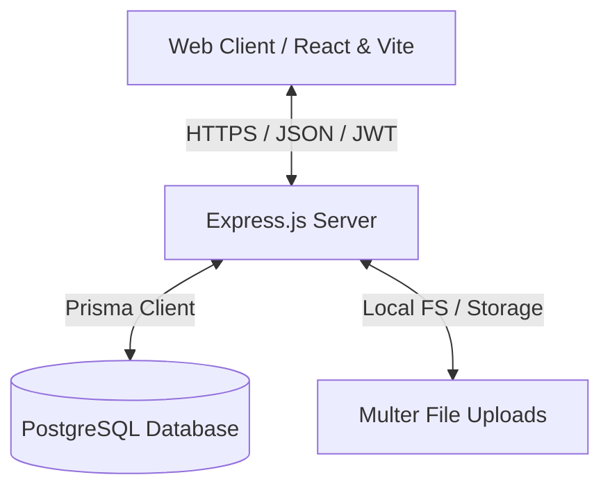

# System Architecture - EcoSphere

This document outlines the architecture and system design for the **EcoSphere – ESG Management Platform**.

## Overview

EcoSphere uses a decoupled frontend-backend architecture:
- **Frontend (Client):** Single Page Application (SPA) built using React, TypeScript, and Vite. It consumes RESTful APIs exposed by the backend.
- **Backend (Server):** Node.js and Express.js REST API server, utilizing TypeScript for type safety and Prisma ORM to interact with a PostgreSQL database.

## Architecture Diagram

## Modular Design

The backend is structured into domain-specific modules:
- **Auth:** JWT-based user authentication and RBAC.
- **Dashboard:** Aggregated metrics and ESG summary analytics.
- **Environmental:** Scope 1/2/3 carbon emissions, waste, and water usage tracking.
- **Social:** Diversity ratios, labor practices, training, and community engagement.
- **Governance:** Compliance logs, board diversity, and anti-corruption policies.
- **Gamification:** Points, levels, achievements, and leaderboard systems.
- **Reports:** Custom ESG reporting generation (PDF, Excel).
- **Settings:** General enterprise configuration and notification settings.
